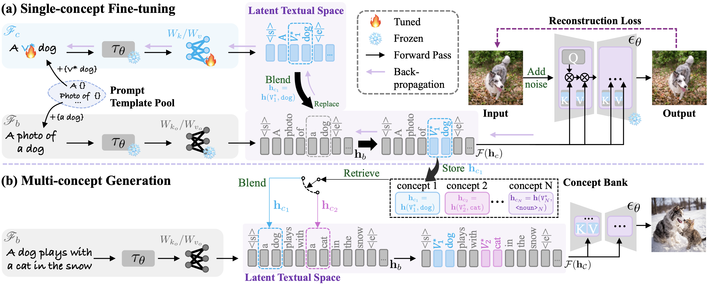

# LatexBlend: Scaling Multi-concept Customized Generation with Latent Textual Blending (CVPR 2025)

<a href="https://arxiv.org/abs/2503.06956"></a>
<a href="https://jinjianrick.github.io/latexblend/"></a>



We propose LatexBlend, a novel framework for effectively and efficiently scaling multi-concept customized text-to-image generation. The core idea of LatexBlend is to represent single concepts and blend multiple concepts within a latent textual space, which is positioned after the text encoder and a linear projection. We identify that the latent textual space is a pivotal point in conditional diffusion models for customized generation, as it encompasses sufficient customized information without being too deep to induce costly merging. Besides, blending customized concepts in this space can eliminate their interference in the earlier textual encoding process, thereby reducing denoising deviation. Therefore, LatexBlend can efficiently integrate multiple customized concepts with high subject fidelity and coherent layouts.

> <a href="https://jinjianrick.github.io/latexblend/">**LatexBlend: Scaling Multi-concept Customized Generation with Latent Textual Blending**</a>
>
>   <a href="https://github.com/jinjianRick">Jian Jin</a>,
    Zhenbo Yu,
    <a href="https://aassxun.github.io/">Yang Shen</a>,
    Zhenyong Fu,
    <a href="https://scholar.google.com.hk/citations?user=6CIDtZQAAAAJ&hl=zh-CN&oi=ao">Jian Yang</a><br>
>
> In CVPR 2025

## Results


## Getting Started

To set up the environment, please run:
```
conda env create -f environment.yml
conda activate latexblend
```
or
```
## install requirements 
conda create -n latexblend python=3.11
conda activate latexblend
pip install torch==2.0.1 torchvision==0.15.2 torchmetrics==1.1.2

pip install accelerate==0.22.0
pip install modelcards
pip install transformers==4.30.2
pip install deepspeed
pip install diffusers==0.21.4
pip install numpy==1.25.2
pip install huggingface_hub==0.16.4
pip install scikit-learn==1.4.2
pip install seaborn
pip install matplotlib==3.8.4

accelerate config default
```

**Pre-trained model**: "stabilityai/stable-diffusion-xl-base-1.0"

## Stpe1 Fine-tuning

Modify the parameters in `train.sh`, then run:

```
bash train.sh
```
**Regularization data:** Download more regularization data from [here](https://drive.google.com/file/d/1-oYRCLq87dKnMm6h8-y6X4WZ5_CU2CoM/view?usp=sharing) or curate your own using the format of the provided examples.

Increase the fine-tuning step ```max_steps``` in ```train.sh``` if the concept fidelity is unsatisfactory.

## Step2 Extract concept representations

Modify the config file `prompt_1_get_concept_bank.json`.

```
[
    {
        "prompt": "photo of a dog",      # 'photo of a <class_noun>'. Include an article such as 'a' before '<class_noun>'.
        "modifier_tokens": "<new1>",    
        "batch_size": 2,
        "num_inference_steps": 100,
        "concept_num": 1,
        "get_concept_bank": true,
        "blending_guidance": false,
        "self_rectification": false,
        "concept_path": "concept_bank/n_2_dog_1500.pt",                 # output path
        "concept1":{
            "prompt": "photo of <new1> dog",                            # format: 'photo of <modifier_tokens> <class_noun>'.
            "class_noun": "dog",                                        # <class_noun>
            "delta_ckpt": "logs/dog_1500_rprefix/delta.bin"             # path to the customized delta_ckpt
        }
    }
]
```

Then run:
```
python src/diffusers_sample.py \
   --ckpt "/opt/data/private/model/stable-diffusion-xl-base-1.0"  \
   --sdxl  \
   --concept_list inference_dict/prompt_1_get_concept_bank.json \
   --deep_replace \
   --device "cuda:0"
```

## Step3 Inference

### Option1: Blending customized concept by simple element-wise replacement
Modify the config file `inference_dict/inference.json`.

```
[
    {
        "prompt": "a dog wearing a sunglasses on the sofa, with a castle in the background",   # prompt
        "modifier_tokens": "<new1>+<new2>+<new3>",                                             # modifier tokens
        "batch_size": 4,
        "num_inference_steps": 100,
        "blending_start": 0.9,
        "concept_num": 3,                                            # concept number
        "get_concept_bank": false,
        "blending_guidance": false,
        "self_rectification": false,
        "concept1": {
            "concept_bank": "concept_bank/n_2_dog_1500.pt",          # path to the concept representation
            "class_noun": "dog"                                      # "<clasa_noun>"
        },
        "concept2": {
            "concept_bank": "concept_bank/n_2_sunglasses_1500.pt",   # path to the concept representation
            "class_noun": "sunglasses"                               # "<clasa_noun>"
        },
        "concept3": {
            "concept_bank": "concept_bank/n_2_castle_1500.pt",       # path to the concept representation
            "class_noun": "castle"                                   # "<clasa_noun>"
        }
    }
]
```

Then run:
```
bash inference.sh "inference_dict/inference.json"
```

### Option2: Blending customized concept with blending guidance
Modify the config file `inference_dict/inference_blendingguidance.json`.

```
[
    {
        "prompt": "a dog wearing a sunglasses on the sofa, with a castle in the background",   # prompt
        "modifier_tokens": "<new1>+<new2>+<new3>",                                             # modifier tokens
        "batch_size": 4,
        "num_inference_steps": 100,
        "blending_start": 0.9,
        "concept_num": 3,                                            # concept number
        "get_concept_bank": false,
        "blending_guidance": true,                                   # true
        "self_rectification": false,
        "guidance_steps": 20,
        "guidance_stepsize": 1,
        "concept1": {
            "concept_bank": "concept_bank/n_2_dog_1500.pt",          # path to the concept representation
            "class_noun": "dog"                                      # "<clasa_noun>"
        },
        "concept2": {
            "concept_bank": "concept_bank/n_2_sunglasses_1500.pt",   # path to the concept representation
            "class_noun": "sunglasses"                               # "<clasa_noun>"
        },
        "concept3": {
            "concept_bank": "concept_bank/n_2_castle_1500.pt",       # path to the concept representation
            "class_noun": "castle"                                   # "<clasa_noun>"
        }
    }
]
```

Then run:
```
bash inference.sh "inference_dict/inference_blendingguidance.json"
```

### Option3: Blending customized concept with self attention rectification
Blending guidance is computationally expensive in terms of memory and time. In our extended version, we propose a self-attention rectification strategy to enable more efficient inference.
Modify the config file `inference_dict/inference_selfrectification.json`.

```
[
    {
        "prompt": "a dog wearing a sunglasses on the sofa, with a castle in the background",   # prompt
        "modifier_tokens": "<new1>+<new2>+<new3>",                                             # modifier tokens
        "batch_size": 4,
        "num_inference_steps": 100,
        "blending_start": 0.9,
        "concept_num": 3,                                            # concept number
        "get_concept_bank": false,
        "blending_guidance": false,
        "self_rectification": true,                                  # true
        "rectification_start": 0.8,
        "concept1": {
            "concept_bank": "concept_bank/n_2_dog_1500.pt",          # path to the concept representation
            "class_noun": "dog"                                      # "<clasa_noun>"
        },
        "concept2": {
            "concept_bank": "concept_bank/n_2_sunglasses_1500.pt",   # path to the concept representation
            "class_noun": "sunglasses"                               # "<clasa_noun>"
        },
        "concept3": {
            "concept_bank": "concept_bank/n_2_castle_1500.pt",       # path to the concept representation
            "class_noun": "castle"                                   # "<clasa_noun>"
        }
    }
]
```

Then run:
```
bash inference.sh "inference_dict/inference_selfrectification.json"
```


##  Acknowledgements
This code is based on the [Custom Diffusion](https://github.com/adobe-research/custom-diffusion). Thank them for their outstanding work.

## Citation

```
@inproceedings{jin2025latexblend,
        title={LatexBlend: Scaling Multi-concept Customized Generation with Latent Textual Blending},
        author={Jin, Jian and Zhenbo, Yu and Yang, Shen and Fu, Zhenyong and Yang, Jian},
        booktitle={Proceedings of the IEEE/CVF conference on computer vision and pattern recognition},
        year={2025}
      }
```
